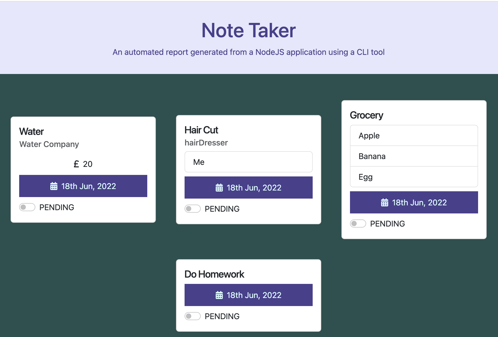

# Notes Generator

## This is the repository for the notes generator

## Table of Contents

- [User Stories](#user-stories)
- [Description](#description)
- [Installation](#installation)
- [Usage](#usage)
- [Screenshot](#screenshot)
- [Teachologies Used](#technologies-used)
- [License](#license)
- [Contact Me](#contact-me)

### User Stories

```
AS a user I want ot use the CLI to generate a note-taker HTML report
```

### Description

- AS a user I want to add a note on bills
- AS a user I want to add a note on appointments
- AS a user I want to add a note on lists
- AS a user I want to add a note on reminders
- AS a user I want to populate a single type of note
- AS a user I want to view all of my notes in the HTML report
- AS a user I want to use the dynamically created report to store the status of my notes in Local Storage

### Installation

```
git clone git@github.com:angelawong3/notes-generator.git
cd notes-generator
npm install inquirer
npm install date-fns
npm install inquirer-date-prompt
npm install uuid
```

### Usage

```
node index.js
or
npm run start
```

### Screenshot


<br />

### Technologies Used

1. JavaScript
2. Node.js

### License

[](https://opensource.org/licenses/MIT)

### Contact Me

Please contact me at angelawong3@yahoo.com

---

© 2022 Angela Wong
